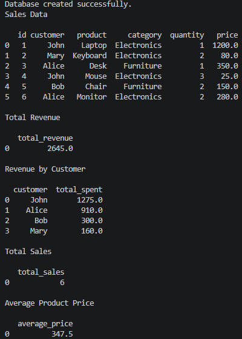

# Sales Database Analyzer

## Output



## Overview

This project demonstrates how to build and query a relational database using SQLite, SQL, Python, and Pandas.

The application creates a sales database, inserts sample sales records, and executes SQL queries to generate business insights such as total revenue, customer revenue, total sales, and average product price.

## Key Features

- Create a SQLite database
- Insert sample sales data
- Retrieve sales records
- Calculate total revenue
- Calculate revenue by customer
- Count total sales
- Calculate the average product price
- Execute SQL queries using Python

## Technologies

- Python
- SQLite
- SQL
- Pandas

## Skills Demonstrated

- SQL querying
- Database creation
- SQLite database management
- Data aggregation
- Business reporting
- Python programming
- Modular programming
- Git and GitHub

## Project Structure

```text
sales-database-analyzer
│
├── data
│   └── sales.db
│
├── output
│   └── terminal_output.png
│
├── src
│   ├── database.py
│   ├── queries.py
│   ├── report.py
│   └── main.py
│
├── README.md
├── requirements.txt
└── .gitignore
```

## How to Run

```bash
pip install -r requirements.txt

cd src

python main.py
```

## Future Improvements

- Export reports to CSV
- Add filtering by customer or category
- Create interactive dashboards
- Migrate to PostgreSQL
- Build a REST API